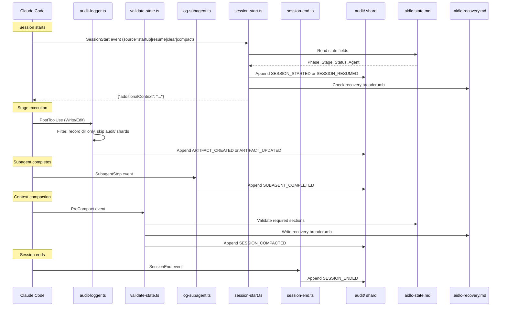

# Hooks and Tools

This chapter documents the hook system architecture, all seventeen hook scripts, the audit event taxonomy, CLI tool configuration, and the deterministic utility tool.

> **Path convention.** State, audit, and artifacts live under the active intent's **record dir** — `aidlc/spaces/<space>/intents/<YYMMDD>-<label>/`, written `<record>/` below (a compact UTC date prefix plus a short kebab-case label so record dirs sort chronologically; the canonical id is the UUIDv7 in the `intents.json` registry row). The audit trail is a directory of per-clone shards under `<record>/audit/`, not a single file.

---

## Hook System Architecture

This implementation uses seventeen TypeScript hook sources in `.claude/hooks/`. The copy channel invokes them through `bun`; the native channel routes them through `aidlc engine hook`, `aidlc engine statusline`, or an `aidlc engine adapter` target. All seventeen are **project-wide** — registered in `settings.json` (the statusline via the top-level `statusLine` key, the other sixteen via the `hooks` block), they fire regardless of which skill is active. They were previously split (six declared in `aidlc/SKILL.md` frontmatter as skill-scoped, the rest project-wide); v0.6.0 moved the skill-scoped six into `settings.json` so every entry point — the orchestrator, each packaged scope/stage runner, and any hand-written customer runner — inherits the deterministic spine with no per-runner `hooks:` block.

Eleven of the seventeen are **non-blocking**. Six are **flow-altering**: the `Stop` hook keeps the forwarding loop running, the dispatch-rules hook attaches exact active-stage rules to subagent briefs where the harness supports input rewriting, the plan-approval guard refuses premature code-generation dispatches, the reviewer-scope hook refuses sibling-unit reviewer access, the review-freeze hook refuses a produces[] write that would void a fresh READY review receipt before the gate, and the state-transition guard refuses direct lifecycle calls that bypass `aidlc-orchestrate.ts report`.

```
.claude/hooks/
+-- mint-presence.ts     # UserPromptSubmit + PostToolUse AskUserQuestion (project-wide, settings.json, TypeScript)
+-- dispatch-rules.ts    # PreToolUse Task|Agent (project-wide, settings.json, TypeScript, flow-altering)
+-- plan-approval-guard.ts # PreToolUse Task (project-wide, settings.json, TypeScript, flow-altering)
+-- state-transition-guard.ts # PreToolUse Bash (project-wide, settings.json, TypeScript, flow-altering)
+-- reviewer-scope.ts    # PreToolUse file/search/shell tools (project-wide, settings.json, TypeScript, flow-altering)
+-- review-freeze.ts     # PreToolUse file-write tools (project-wide, settings.json, TypeScript, flow-altering)
+-- audit-logger.ts      # PostToolUse Write|Edit (project-wide, settings.json, TypeScript)
+-- sensor-fire.ts       # PostToolUse Write|Edit (project-wide, settings.json, TypeScript)
+-- sync-statusline.ts   # PostToolUse TaskUpdate (project-wide, settings.json, TypeScript)
+-- runtime-compile.ts   # PostToolUse Bash (project-wide, settings.json, TypeScript)
+-- fold-usage.ts        # PreToolUse + PostToolUse (project-wide, settings.json, TypeScript, Claude-only producer)
+-- validate-state.ts    # PreCompact (project-wide, settings.json, TypeScript)
+-- log-subagent.ts      # SubagentStop (project-wide, settings.json, TypeScript)
+-- aidlc-stop.ts        # Stop (project-wide, settings.json, TypeScript, flow-altering)
+-- session-start.ts     # SessionStart (project-wide, settings.json, TypeScript)
+-- session-end.ts       # SessionEnd (project-wide, settings.json, TypeScript)
+-- aidlc-statusline.ts  # statusLine (project-wide, settings.json, TypeScript)
```

### Hook Summary

| Hook | Event | Scoping | Matcher | Purpose |
|------|-------|---------|---------|---------|
| `mint-presence.ts` | UserPromptSubmit + PostToolUse | Project-wide (settings.json) | (empty) / `AskUserQuestion` | Record a `HUMAN_TURN` event on every real human prompt and on every answered `AskUserQuestion` widget (gate approvals and interview answers are widget clicks, not typed prompts); the approval/interview gate checks the ledger and requires one since the last gate resolution so a model under autopilot cannot fabricate an approval with no human having acted |
| `dispatch-rules.ts` | PreToolUse | Project-wide (settings.json) | `Task\|Agent` | **Flow-altering.** Resolve the dispatched stage's substantive active-space rules and append their exact bytes to every AI-DLC subagent brief. Rewrites Claude, Codex, and opencode inputs; Kiro CLI cannot rewrite tool arguments, so an incomplete brief proceeds with an advisory warning (Kiro CLI agents preload the active memory tree through `resources`; an unloadable required rule still blocks with repair guidance). Kiro IDE uses always-included workspace steering with live memory-file references. Idempotent when the exact bundle is already present |
| `plan-approval-guard.ts` | PreToolUse | Project-wide (settings.json) | `Task` | **Flow-altering.** Enforce code-generation's plan-before-generation ordering (stage Steps 2-4) deterministically: while the workflow's Current Stage is code-generation, a Task dispatch targeting `aidlc-developer-agent` is refused (exit 2 + a redirecting stderr reason) unless its one explicit `AIDLC-UNIT: <unit>` marker identifies a known unit with a non-empty `code-generation-plan.md` on disk AND a Plan Approval question recording the explicit "Approve Plan" response. Each refusal emits `PLAN_APPROVAL_BLOCKED`; missing, conflicting, or unknown markers block instead of guessing from prompt prose. `AIDLC_DISABLE_PLAN_APPROVAL_GUARD=1` disables enforcement |
| `state-transition-guard.ts` | PreToolUse | Project-wide (settings.json) | `Bash` | **Flow-altering.** Refuse direct `aidlc-state.ts` lifecycle verbs and redirect the conductor to `aidlc-orchestrate.ts report`; read-only and specialized recovery/configuration verbs remain available |
| `reviewer-scope.ts` | PreToolUse | Project-wide (settings.json) | `Read\|Edit\|Write\|Glob\|Grep\|Bash` | **Flow-altering.** Enforce the per-unit reviewer read-scope bound (stage-protocol §12a) deterministically: while the conductor's reviewer dispatch record (`<record>/.aidlc-reviewer-dispatch.json`) is fresh, the dispatched reviewer's tool calls that reach into sibling units' `construction/` paths — file reads/writes and grep/glob/shell patterns spanning siblings — are refused (exit 2 + a redirecting stderr reason) unless the target is on the record's exempt list. Each refusal emits `REVIEWER_SCOPE_BLOCKED`. Fail-open on every ambiguity; `AIDLC_DISABLE_REVIEWER_SCOPE_HOOK=1` disables enforcement |
| `review-freeze.ts` | PreToolUse | Project-wide (settings.json) | `Read\|Edit\|Write\|Glob\|Grep\|Bash` (self-filters to mutation-capable calls) | **Flow-altering.** Enforce the §12a terminal-receipt ordering deterministically: a Write/Edit or shell mutation targeting a reviewer-bearing, not-yet-completed stage's declared `produces[]` artifact is refused (exit 2 + a redirecting stderr reason) while a fresh READY review receipt covers it. Shell writes are inspected before execution because they do not pass through the Write/Edit audit feed and would otherwise preserve a stale receipt over changed bytes. Shares the engine's exact receipt scan (`freshReviewReceipts` in `aidlc-lib.ts`), so a recorded gate rejection, jump, or workflow restart lifts the freeze automatically and a NOT-READY verdict never freezes. Each refusal emits `REVIEW_FREEZE_BLOCKED`. Fail-open on every ambiguity; `AIDLC_DISABLE_REVIEW_FREEZE_HOOK=1` disables enforcement |
| `audit-logger.ts` | PostToolUse | Project-wide (settings.json) | `Write\|Edit` | Auto-log artifact writes to the `audit/` shards |
| `sensor-fire.ts` | PostToolUse | Project-wide (settings.json) | `Write\|Edit` | Fire the active stage's resolved Sensors on matching writes (advisory; never blocks) |
| `sync-statusline.ts` | PostToolUse | Project-wide (settings.json) | `TaskUpdate` | Auto-sync state file on stage task activation |
| `runtime-compile.ts` | PostToolUse | Project-wide (settings.json) | `Bash` | Recompile `runtime-graph.json` on transition-class audit emits |
| `fold-usage.ts` | PreToolUse + PostToolUse | Project-wide (settings.json) | (empty) | **Claude-only.** Fold the transcript's new token usage into the durable usage ledger every llm call: PreToolUse seals the completing main call and, before an engine boundary, every completed subagent call so lifecycle rollups are current; PostToolUse supplies the normal holdback fallback. Observe-only, never blocks; the Claude-Code transcript reader is wired only in the Claude harness, so on Kiro/Codex/opencode no producer runs and the ledger stays empty (every usage consumer degrades to no-data). See "Token usage and cost tracking" below |
| `validate-state.ts` | PreCompact | Project-wide (settings.json) | (empty) | Validate state file, write recovery breadcrumb |
| `log-subagent.ts` | SubagentStop | Project-wide (settings.json) | (empty) | Log subagent completion events |
| `aidlc-stop.ts` | Stop | Project-wide (settings.json) | (empty) | **Flow-altering.** Enforce the forwarding loop on turn-end: run `aidlc-orchestrate next`; on `done` or `parked` allow the stop, on a pending directive block the stop and inject the next move back via `reason`. Allows the stop (human-wait carve-out) when the current stage is awaiting approval (`[?]`), being revised (`[R]`), `[-]` in-progress with an unanswered question in its canonical or active per-unit `<slug>-questions.md`, or the ending turn was conversational (the human's last prompt was answered with no workflow-engine call, read from the harness transcript) - the last two suppressed under autonomous Construction. Recursion-bounded (no-progress counter + `stop_hook_active` under `CLAUDE_CODE_STOP_HOOK_BLOCK_CAP`; default 2 in an interactive run and 8 under autonomous Construction). No-op outside an AIDLC workflow |
| `session-start.ts` | SessionStart | Project-wide (settings.json) | (empty) | Inject workflow context on session resume |
| `session-end.ts` | SessionEnd | Project-wide (settings.json) | (empty) | Emit `SESSION_ENDED` audit event on graceful exit |
| `aidlc-statusline.ts` | statusLine | Project-wide (settings.json) | -- | Show real-time progress in terminal |

### Shared Characteristics

All seventeen TypeScript hook sources:

- Are written in TypeScript and invoked through the channel's dispatcher
- Do not need executable permissions — work identically on macOS, Linux, and native Windows PowerShell
- Receive JSON on stdin from Claude Code
- Use native JSON parsing (no `jq` dependency)
- Exit with code 0 on success or when skipped (the `Stop` hook also exits 0 when it blocks — the block is signalled by a `{"decision":"block"}` JSON object on stdout; the four PreToolUse control hooks signal an unrecoverable or retryable refusal with exit 2 + the reason on stderr)
- Resolve `$CLAUDE_PROJECT_DIR` with multiple fallback methods
- Share locking and utility functions from `lib.ts`

### Audit Event Flow



---

## Workflow-Spine Hooks

These six hooks (the audit/sensor/statusline/runtime-compile/state-validation/subagent spine) are registered project-wide in `settings.json`. They are always on, but each **self-gates**: it early-exits when there is no active workflow (`aidlc-state.md` / the active intent's `audit/` shard absent), so audit logging and state sync never clutter non-AI-DLC sessions. Before v0.6.0 they were declared in `aidlc/SKILL.md` frontmatter (skill-scoped); the move to `settings.json` lets every entry point — the orchestrator and every packaged or hand-written runner — inherit the spine without copying a `hooks:` block.

### PostToolUse: audit-logger.ts

**Source:** `.claude/hooks/aidlc-audit-logger.ts`
**Trigger:** After every `Write` or `Edit` Claude Code tool call (matcher: `"Write|Edit"`)
**Purpose:** Auto-log artifact writes to the intent's `audit/` shards

**Processing steps:**

1. **Project directory resolution:** Resolves `$CLAUDE_PROJECT_DIR` with fallback to script path derivation and CWD detection.
2. **Health heartbeat:** Writes UTC timestamp to `.aidlc-hooks-health/audit-logger.last`.
3. **JSON parsing:** Reads stdin, extracts `tool_name` and `tool_input.file_path`.
4. **Path filtering:** Skips files not under the intent's record dir. Skips the `audit/` shards themselves (avoids recursion).
5. **Audit file guard:** Exits silently if the active intent's `audit/` shard does not exist (the framework creates it).
6. **Context extraction:** Strips the path prefix up to the record dir, replaces `/` with ` > ` for a breadcrumb (e.g., `inception > requirements-analysis > requirements.md`).
7. **Atomic locking:** Uses `mkdir`-based lock in the system temp directory (`os.tmpdir()`) with 3-retry loop (100ms delay). The hash isolates locks per project.
8. **Log entry:** Appends a canonical `ARTIFACT_CREATED` (for Write to a net-new path) or `ARTIFACT_UPDATED` (for Edit, or Write overwriting existing) event via `appendAuditEntry`. Fields: Timestamp, Event, Tool, File, Context.

### PostToolUse: sync-statusline.ts

**Source:** `.claude/hooks/aidlc-sync-statusline.ts`
**Trigger:** After every `TaskUpdate` call (matcher: `"TaskUpdate"`)
**Purpose:** Auto-sync `aidlc-state.md` when a stage task becomes `in_progress`

**Processing steps:**

1. **Project directory resolution:** Same multi-fallback pattern as audit-logger.ts.
2. **Status filter:** Only fires when `status` is `in_progress`. Exits silently for `completed`, `pending`, etc.
3. **activeForm filter:** Exits silently if no `activeForm` field or no `[slug]` suffix pattern.
4. **State file guard:** Exits silently if `aidlc-state.md` does not exist (pre-init).
5. **Health heartbeat:** Writes to `.aidlc-hooks-health/sync-statusline.last`.
6. **State sync:** Calls the utility dispatch route `set-status --stage <slug>` (updates Phase, Stage, Agent, checkbox).

**Design notes:**
- Stage Jump tasks (no `[slug]`) and dependency-wiring TaskUpdates (no activeForm) are naturally filtered out.
- The hook calls the existing `set-status` subcommand — no new code path needed.

### PostToolUse: sensor-fire.ts

**Source:** `.claude/hooks/aidlc-sensor-fire.ts`
**Trigger:** After every `Write` or `Edit` Claude Code tool call (matcher: `"Write|Edit"`)
**Purpose:** Fire the active stage's compile-resolved Sensors on matching writes (advisory; never blocks)

**Processing steps:**

1. **Project directory resolution:** Same multi-fallback pattern as audit-logger.ts.
2. **Audit + state guards:** Exits silently if the `audit/` shard or `aidlc-state.md` does not exist (pre-init).
3. **Active-stage read:** Reads the active stage's `sensors_applicable` array off `stage-graph.json` — the compile-resolved sensor list for that stage node (empty for stages like workspace-scaffold).
4. **Dispatch:** For each applicable Sensor, invokes `aidlc engine sensor fire <id> --stage <slug> --output-path <path>` through the selected channel. The dispatcher applies each Sensor's `matches` glob hook-side; a non-matching write is skipped. Outcomes are advisory — the hook never blocks the write.
5. **Health heartbeat:** Writes `.aidlc-hooks-health/sensor-fire.last` on a fire, so the doctor can distinguish a healthy idle hook from a silent failure.

See [Sensor System](07-sensor-system.md) for the manifest schema and the fire lifecycle.

### PostToolUse: runtime-compile.ts

**Source:** `.claude/hooks/aidlc-runtime-compile.ts`
**Trigger:** After every `Bash` Claude Code tool call (matcher: `"Bash"`)
**Purpose:** Recompile `runtime-graph.json` when a transition-class audit event has just landed

**Processing steps:**

1. **Command filter:** Only engine commands routed to state, jump, Bolt, or utility handling pass the early exit. Runtime-compile dispatch is rejected explicitly (recursion guard).
2. **Audit-existence guard:** Exits cleanly before init (no `audit/` shard yet).
3. **Health heartbeat:** Writes `.aidlc-hooks-health/runtime-compile.last`.
4. **Tail-read:** Splits the merged `audit/` shards on `\n---\n` and takes the last 3 blocks (the upper bound a single `approve` call appends).
5. **Event-class filter:** Recompiles only when one of the last 3 blocks carries `GATE_APPROVED`, `STAGE_STARTED`, `STAGE_AWAITING_APPROVAL`, `AUDIT_MERGED`, or `WORKFLOW_COMPLETED`. Exits on no match.
6. **Dispatch:** Runs `aidlc engine runtime compile` through the selected channel. On non-zero exit, records a hook drop for `--doctor`; never blocks the parent Bash call.

See [Runtime Graph](13-runtime-graph.md) for the compile lifecycle and the locked schema.

### PreCompact: validate-state.ts

**Source:** `.claude/hooks/aidlc-validate-state.ts`
**Trigger:** Before Claude Code compacts the conversation context (matcher: empty = always)
**Purpose:** Section presence check (informational only, does not block compaction) and write a recovery breadcrumb

**Processing steps:**

1. **State file guard:** Exits cleanly if `aidlc-state.md` does not exist.
2. **Section validation:** Checks for two mandatory sections using `grep -q`:
   - `## Stage Progress` -- the checklist of all stages with completion status
   - `## Current Status` -- current phase, stage, and scope
   Outputs a WARNING if either section is missing (informational only -- cannot block compaction).
3. **Recovery breadcrumb:** Writes `.aidlc-recovery.md` containing the current stage and a validation timestamp. On session resume, the framework compares this with `aidlc-state.md` to detect compaction-related state corruption.

**Why this matters:** Context compaction discards conversation history. If compaction happens mid-stage, the model loses awareness of what it was doing. The recovery breadcrumb provides an external checkpoint that survives compaction.

### SubagentStop: log-subagent.ts

**Source:** `.claude/hooks/aidlc-log-subagent.ts`
**Trigger:** When any subagent (Claude Code Task tool invocation) completes (matcher: empty = always)
**Purpose:** Log subagent completion events to the audit trail

**Processing steps:**

1. **Project directory resolution:** Same multi-fallback pattern as audit-logger.ts.
2. **Health heartbeat:** Writes to `.aidlc-hooks-health/log-subagent.last`.
3. **JSON parsing:** Extracts `agent_type` (defaults to `"unknown"`), `agent_id`, and `last_assistant_message` (truncated to 200 characters).
4. **Audit file guard:** Exits silently if the `audit/` shard does not exist.
5. **Entry assembly:** Emits canonical `SUBAGENT_COMPLETED` event via `appendAuditEntry`. Fields: Timestamp, Event, Agent Type, and optionally Agent ID and truncated Message.
6. **Atomic locking:** Same `mkdir`-based pattern as audit-logger.ts (unified in `lib.ts`) but with a separate lock name to avoid contention.

**Fires for every dispatched agent:**
- Stage 2.1 (Reverse Engineering, `mode: pipeline`) -- fires twice per repo: `aidlc-developer-agent` code scan, then `aidlc-architect-agent` synthesis
- Stage 3.5 (Code Generation, `mode: subagent`) -- `aidlc-developer-agent` (fires once per unit of work)
- Ensemble stages (`mode: mob`, or `subagent` with support agents) -- fires once per dispatched collaborator and per lead dispatch (e.g. user-stories fires for each of its three collaborators)

Workspace detection (0.2) used to be a subagent; it now runs deterministically inside `aidlc-utility intent-birth`, so this hook no longer fires during initialization.

---

### Stop: aidlc-stop.ts

**Source:** `.claude/hooks/aidlc-stop.ts`
**Trigger:** When the conductor tries to end its turn (matcher: empty = always, while `/aidlc` is active)
**Purpose:** Enforce the interactive forwarding loop — keep it running until the engine reports the workflow is `done`

This is one of the framework's five flow-altering hooks, alongside the four PreToolUse controls below. It may return `{"decision":"block"}` to stop the turn from ending; the other eleven hooks observe and exit 0. On the gated, conversational path the conductor (the LLM) holds the loop because only it can ask the human a question — so if it forgets to consult the engine, the workflow drifts. This hook removes that dependency on the LLM's diligence: the loop is enforced by the harness.

**Processing steps:**

1. **stdin idiom:** Mirrors `log-subagent.ts` — a TTY means no Claude Code JSON is coming (test/debug), so it allows the stop. Otherwise it reads the Stop-hook JSON, from which it needs only `stop_hook_active`.
2. **No-op outside AIDLC:** If there is no active intent's `aidlc-state.md` under the project dir, there is nothing to enforce — it allows the stop. The frontmatter `Stop` matcher already scopes the hook to `/aidlc`; this is defence in depth so a non-AIDLC session is never blocked.
3. **Compose the engine:** Runs `aidlc engine orchestrate next --project-dir <dir>` through the selected channel and parses the directive `kind`. It does not re-derive state — it composes the engine.
4. **`done` → allow:** If the directive is `done`, the workflow is complete; the hook emits nothing and exits 0 (the precedent non-blocking pattern), then clears the recursion counter.
5. **`parked` -> allow:** If the directive is `parked`, the workflow was intentionally parked mid-flow for a later session (`aidlc-orchestrate park`); the hook allows the stop and clears the counter, exactly like `done`. This is the supported multi-session exit: without it, the only clean stop is `done`, which an agent on a long workflow can only reach by rubber-stamping the remaining stages (#367). **Autonomy guard (#365):** the `parked` allow is suppressed under autonomous Construction (`Construction Autonomy Mode: autonomous`), so a `parked` directive there falls through to the cap-bounded block and the loop keeps moving.
6. **Human-wait -> allow:** If the directive is pending but the conductor is correctly parked on the human (or simply chatting), the hook allows the stop and records a drop rather than spamming the nudge. Four cases qualify: the current stage's checkbox is positively `[?]` awaiting-approval, `[R]` revising, `[-]` in-progress **with** an unanswered `[Answer]:` tag in its `<slug>-questions.md` (a pending mid-stage clarifying question), or the ending turn was conversational (the human's most recent prompt was answered with no workflow-engine call, read from the harness transcript) - the last two suppressed under autonomous Construction. Positive-confirmation only: any other state, no checkbox row, no open question, no transcript / no human prompt / any engine call in the responding turn, or a parse error falls through to the block below. See "Human-wait carve-out" below.
7. **Pending -> block and inject:** For any other (pending) directive - `run-stage`, `dispatch-subagent`, `invoke-swarm`, `present-gate`, `ask`, `print`, `error` - it prints `{"decision":"block","reason":<on-task continuation>}`, so the same session resumes with the next move injected. The injected `reason` also names `aidlc-orchestrate park` as the clean-pause alternative, so a conductor that wants to stop a long workflow parks rather than advancing.
8. **Fail open:** Any unexpected failure (unreadable state, an engine that exits non-zero or returns no parseable directive, malformed stdin) allows the stop and records a drop. Failing open is the only safe failure mode for a hook that can otherwise trap a turn.

**Security property — the `reason` is an on-task continuation, never an override.** The injected `reason` names the work the conductor still owes ("run the forwarding loop, act on the directive, then report"), never an instruction to do something new or out-of-band. Override-shaped directives are refused by the conductor's own safety training; that refusal is the security property. A buggy or compromised engine therefore can only ever *continue* sanctioned work — it cannot hijack the session to act against the user.

**Recursion guard — a stuck block can never trap the session.** A block that re-fires forever is the one way a hook could trap a turn, so recursion is bounded two ways, both native:

- **`stop_hook_active`** — Claude Code sets this true when the current stop is itself the product of a prior Stop-hook block. The hook reads it as a signal that it is already inside a blocked sequence.
- **A no-progress counter** - the hook persists a small record under `<record>/.aidlc-stop-hook/block-count.json` (in the intent's record dir), keyed on the workflow's *progress signature* (Current Stage slug + audit-tail length). A `report` that advances the workflow changes that signature, so the counter resets - a healthy loop is never throttled. When the signature is unchanged across consecutive blocks (no report ran), the counter increments. Once the no-progress streak reaches the ceiling - `CLAUDE_CODE_STOP_HOOK_BLOCK_CAP`, whose default is **run-mode aware: 2 in an interactive run and 8 under autonomous Construction** (interactive 2 so a chatting or pausing human is released after one nudge; autonomous 8 so an unattended loop, with no human to release it, runs to completion before letting go) - the hook **releases** the turn (allows the stop), so a stuck loop always lets go. An explicit `CLAUDE_CODE_STOP_HOOK_BLOCK_CAP` overrides both defaults.

**Human-wait carve-out - an interactive gate is not punished.** Four cases where the conductor ends its turn *because* it is waiting on the human (or is simply conversational) are handled so the hook never spams the nudge:

- **Esc is free.** Stop hooks do not fire on user interrupt (Esc), so a manual interrupt can never be trapped — no code is needed for that case.
- **The approval gate is not free.** The Stop hook *does* fire when the conductor ends its turn to await an `AskUserQuestion` answer. At an approval gate (the current stage is `[?]` awaiting-approval) or in the Request-Changes loop (`[R]` revising) the engine still re-emits a pending `run-stage` for the in-flight stage, so without a carve-out the hook would block and re-inject the forwarding-loop nudge until the cap bled out — confusing at an interactive gate. So when the current stage's checkbox is positively `[?]`/`[R]`, the hook allows the stop. This is **positive-confirmation only and fail-open**: it only ever releases more readily, never blocks more; a missing checkbox row and any parse error fall through to the cap-bounded block, so a genuine mid-stage quit is still nudged.
- **A mid-stage clarifying question is not free either.** Such a question parks the stage at `[-]` in-progress — the same checkbox state as a lazy quit, so `[-]` alone cannot be carved out. But the conductor must create a `<slug>-questions.md` with blank `[Answer]:` tags before asking (stage protocol §3), so an unanswered tag is a positive signal that a question is pending. The hook checks the canonical `<record>/<phase>/<slug>/` directory, or for a per-unit Construction directive, the exact `<record>/construction/<unit>/<slug>/` named by `next`; it does not accept a stale question from another unit. When the current `[-]` stage's questions file has an unanswered tag, the hook allows the stop. This is **strictly gated**: it never fires under autonomous Construction (`Construction Autonomy Mode: autonomous`), where the loop must keep running unattended, and it falls through to the cap-bounded block on any miss — no file, all answered, autonomous, or a read error — so a genuine mid-stage quit is still nudged. (Immediate mitigation for any residual case: `CLAUDE_CODE_STOP_HOOK_BLOCK_CAP=1`.)
- **A conversational turn is not free either.** During an active workflow a human who just wants to chat (ask a question, discuss a decision) should not be nudged back into the loop. The hook reads the harness transcript and allows the stop when the most recent genuine human prompt was answered with **no** workflow-engine engagement - the conductor ran neither `aidlc-orchestrate` nor `aidlc-state` since that prompt. A read-only query (`--status`, `--doctor`, `--help`, `--version`) does **not** count as engagement, so "what stage am I on?" answered with `--status` still qualifies as chat. Claude and Codex deliver `transcript_path` on the Stop payload; **Kiro and opencode deliver none** (opencode's `session.idle` event carries no transcript), so on those harnesses this carve-out is inert and the run-mode-aware interactive cap (2) is the release path that lets a chatting human go after one nudge instead of eight. This is **strictly gated and fail-closed**: it never fires under autonomous Construction, and a missing or unreadable transcript, no human prompt found, or any engine call in the responding turn falls through to the cap-bounded block, so a conductor that engaged the workflow and then quit mid-loop is still nudged. It only ever ALLOWS - it can never block more.

> **Contrast with the sensor-fire hook's advisory contract.** `aidlc-sensor-fire.ts` carries an explicit *never-block* contract (it never returns `{decision: block}`, asserted by `t95` Case 7). That is *that hook's* advisory contract, not a framework-wide ban on blocking. The `Stop` hook's use of `block` for loop enforcement is a different, sanctioned contract.

---

### PreToolUse: aidlc-dispatch-rules.ts

**Source:** `.claude/hooks/aidlc-dispatch-rules.ts`
**Trigger:** Before AI-DLC subagent calls (`Task` or `Agent` on Claude; adapter equivalents on other harnesses)
**Purpose:** Preserve exact active-stage rules across the conductor-to-worker boundary

The orchestration engine already delivers substantive rules to the conductor through bounded `load-steering` chunks. This hook closes the next boundary: it resolves the dispatch stage from a valid explicit stage-file path first, then the state file's `Current Stage`, and finally a unique slug mention when no live stage is available. An unknown path-shaped reference does not suppress the live-stage fallback. It reads the same active-space rule roster as the engine and appends the exact file contents in a digest-marked bundle. Only that complete generated block counts as already delivered, so markerless copies or prose that reframes the rules do not bypass injection and retries remain idempotent. Every installed agent-roster entry except the composer participates, including plugin-owned agents; targets outside the roster pass unchanged.

Claude and Codex consume `hookSpecificOutput.updatedInput`; the opencode adapter applies that rewrite to `output.args`. The hook serializes the complete response before writing and refuses an oversized response with repair guidance, so a transport ceiling cannot turn it into truncated JSON. Kiro CLI exposes subagent arguments but has no rewrite channel, so its adapter observes the proposed rewrite and emits an advisory warning while allowing dispatch; its agent-v1 `resources` preload the memory tree. A valid bundle that exceeds the rewrite limit also proceeds through that native preload, while a missing, unreadable, or invalid UTF-8 required rule still blocks with repair guidance. Kiro IDE exposes no tool arguments to hooks and does not register this hook; `.kiro/steering/aidlc-active-memory.md` is always included and uses live file references to preload the active memory tree for the conductor and delegated agents.

---

### PreToolUse: aidlc-state-transition-guard.ts

**Source:** `.claude/hooks/aidlc-state-transition-guard.ts`
**Trigger:** Before `Bash` tool calls
**Purpose:** Keep workflow lifecycle mutations behind the orchestration engine

The guard refuses direct `aidlc-state.ts` lifecycle verbs with exit 2 and a
redirecting stderr reason. The conductor uses `aidlc-orchestrate.ts report` for
gate and completion outcomes, `aidlc-orchestrate.ts park` for parking, and
`next`/jump flows for routing. Read-only state queries and specialized
recovery/configuration verbs remain available. The state CLI independently
checks the same ownership marker, covering harnesses whose pre-tool payload
cannot expose the shell command.

---

### PreToolUse: aidlc-reviewer-scope.ts

**Source:** `.claude/hooks/aidlc-reviewer-scope.ts`
**Trigger:** Before file/search/shell tool calls (`Read`, `NotebookRead`, `Edit`, `MultiEdit`, `Write`, `NotebookEdit`, `LS`, `Glob`, `Grep`, or `Bash`; matcher: `"Read|NotebookRead|Edit|MultiEdit|Write|NotebookEdit|LS|Glob|Grep|Bash"`)
**Purpose:** Enforce the per-unit reviewer read-scope bound (stage-protocol §12a) deterministically

This is one of the framework's five flow-altering hooks and one of its four `PreToolUse` controls. The §12a prose bound says a reviewer dispatched for one unit must not read sibling units' `construction/<other-unit>/` content through any tool — field transcripts showed a diligent reviewer bypassing the prose with recursive greps carrying cross-unit globs (`construction/*/*/*.md`), growing per-unit review cost superlinearly with unit count. Per the framework's layering (determinism belongs in tools and hooks), this hook makes the bound self-enforcing.

**How it learns the dispatch.** The conductor writes `<record>/.aidlc-reviewer-dispatch.json` at §12a step 1 (per-unit stages only) — `{reviewer, stage, unit, exempt[]}`, where `exempt` carries the resolved `consumes` contract paths, the stage file, the Q&A file, and (when the current unit's design explicitly names an integration point) that one owning sibling file — and deletes it at step 3 when the verdict is read. The record is the enforcement window; a record older than 6 hours is an orphan from a crashed review, ignored and janitored (the compose-marker staleness discipline).

**Identity.** Claude Code and Codex deliver the active subagent's name as `agent_type` on the hook payload (absent on main-session calls), so the hook enforces only when `agent_type` equals the record's `reviewer`. The Kiro CLI registers the hook inside the two reviewer agents' own JSON configs, so the registration itself is the identity (the adapter asserts `scoped_registration`). Kiro IDE ships no registration: tool inputs are not uniformly available across its supported generations (the captured PostToolUse write/shell inputs are empty; later 1.x builds populate some PreToolUse and delegation inputs - see `kiro-ide-hook-payload.md`), so the framework cannot depend on a stable pre-tool identity/target contract there and the §12a prose bound governs on that harness.

**Decision.** The matcher (`evaluateReviewerScope`, an exported pure function pinned by `t220`) scans path fields and command/pattern text for `construction/<seg>` tokens: the dispatched unit passes, a wildcard or bare sweep root blocks, and a concrete sibling blocks unless the full token exactly matches an exempt entry's `construction/` suffix. A grep of the current unit, the shared inception contracts, and validation-tool runs are never touched. Blocks emit a `REVIEWER_SCOPE_BLOCKED` audit row (Tool, Target, Stage, Unit) and signal via **exit 2 + a redirecting stderr reason** — the harness PreToolUse reject contract — that names the scope and points the reviewer back to the passed contracts.

**Fail-open everywhere.** No record, a stale or malformed record, a non-reviewer agent, an unknown tool, malformed stdin, or any internal error allows the call; a reviewer-agent sighting with no dispatch record records an advisory drop for `--doctor` (the conductor forgot the step-1 write). The deterministic off-switch `AIDLC_DISABLE_REVIEWER_SCOPE_HOOK=1` disables enforcement entirely.

### Plan-Approval Guard Hook

**Source:** `.claude/hooks/aidlc-plan-approval-guard.ts`
**Trigger:** Before subagent dispatches (matcher: `"Task"`)
**Purpose:** Enforce Code Generation's plan-before-generation ordering (stage Steps 2-4) deterministically

This is one of the framework's five flow-altering hooks and one of its four `PreToolUse` controls. The stage prose says generation never begins before the human answers "Approve Plan" - a field report showed a conductor generating the code first and backfilling `code-generation-plan.md` beside `code-summary.md`, turning the plan into a retroactive summary. The stage-completion artifact guard cannot catch that inversion (it fires at completion, when the backfilled plan already exists), so this hook refuses the dispatch itself.

**Decision.** The guard acts only when the workflow's `Current Stage` is code-generation and the tool call is a `Task` dispatch whose `subagent_type` is `aidlc-developer-agent`. Step 4 requires the delegation prompt to start with `AIDLC-UNIT: <directive.unit>` (or the current single-iteration unit). The guard resolves that exact marker against the workflow's known units (the compiled bolt DAG plus the on-disk `construction/<unit>/` dirs), then requires that unit to have BOTH a non-empty `code-generation-plan.md` on disk AND an explicit "Approve Plan" answer on the Plan Approval question in `code-generation-questions.md`. Contextual mentions of sibling units have no effect; missing, conflicting, or unknown markers block. The Plan Approval identifier may share the heading with its question number (`Q1: Plan Approval` or `Question 1 - Plan Approval`) or appear as the first question-text line under a numbered heading (`## Q1` followed by `Plan Approval`); blank tags, "Request Changes", unrelated answered questions, and examples inside HTML comments or fenced code do not authorize generation. The same evidence is mandatory under autonomous Construction, matching the stage's every-execution-mode hard stop. The decision (`evaluatePlanApprovalDispatch`, an exported pure function pinned by `t263`) blocks with **exit 2 + a redirecting stderr reason** naming the missing evidence and the stage steps that produce it, and emits a `PLAN_APPROVAL_BLOCKED` audit row (Tool, Target, Stage, Unit).

**Fail-open outside the guarded dispatch.** No state file, another stage, another agent or tool, malformed stdin, or any internal error allows the call. Once a code-generation developer dispatch is identified, missing or ambiguous target evidence blocks. The deterministic off-switch `AIDLC_DISABLE_PLAN_APPROVAL_GUARD=1` disables enforcement entirely. On Kiro CLI the conductor agent registers the guard on its `subagent` matcher (the adapter translates the crew schema); on Codex it rides the `spawn_agent` PreToolUse seam; on opencode the plugin consults it before `task` dispatches; Kiro IDE documents the bound as prose-only, like its other guards.

---

### PreToolUse: aidlc-review-freeze.ts

**Source:** `.claude/hooks/aidlc-review-freeze.ts`
**Trigger:** Before file-write and shell tool calls (`Write`, `Edit`, `MultiEdit`, `NotebookEdit`, `Bash`; registered in the shared PreToolUse matcher group, self-filtering to mutation-capable calls)
**Purpose:** Enforce the §12a terminal-receipt ordering deterministically - the write-freeze between a READY review receipt and the gate

This is one of the framework's five flow-altering hooks and one of its four `PreToolUse` controls. Each `REVIEW_COMPLETED` row records a SHA-256 fingerprint of the declared artifact paths and bytes. The completion precondition accepts the receipt only while that fingerprint still matches, independent of which harness or tool changed the file; the existing audit-event floor remains an early invalidation signal. Autonomous swarm finalization also requires every applicable required artifact to exist as a file in the Bolt worktree (an absent optional output remains a valid fingerprint entry). Field traces showed prose losing the ordering contest: a conductor applied reviewer suggestions AFTER recording the terminal receipt, voided its own receipt, re-reviewed, re-edited, and oscillated until the live session wedged at the gate. This hook refuses recognizable writes before they happen, while the content fingerprint is the harness-independent correctness floor.

**Decision.** For each write target the hook checks, against every reviewer-bearing stage that is not yet completed or skipped in the state file: does the path match a declared `produces[]`/`optional_produces[]` artifact (the engine's own suffix matcher, `producesArtifactUnit`), and does a fresh READY receipt currently cover it (`freshReviewReceipts` - the SAME scan the engine's completion precondition reads, shared in `aidlc-lib.ts` so the freeze window and the refusal window cannot diverge)? Freshness requires both the audit chronology and an exact current artifact fingerprint. Per-unit stages freeze only the reviewed unit's artifacts; an ambiguous per-unit path freezes if any unit holds a READY receipt. A NOT-READY verdict never freezes (the repair loop must edit), and a recorded gate rejection, jump, workflow restart, audited write, or content mismatch invalidates the receipt. Blocks emit a `REVIEW_FREEZE_BLOCKED` audit row (Tool, Target, Stage, optional Unit) and signal via **exit 2 + a redirecting stderr reason** that names the sanctioned routes: present the gate and quote suggestions there, or reject at the gate to reopen the artifact.

**Shell writes.** The audit-logger hook that feeds the engine's invalidation scan is a Write/Edit PostToolUse hook, so a file mutation delivered as a shell command would otherwise be invisible and leave a stale READY receipt covering changed bytes. The freeze therefore extracts output-redirection targets and operands of common mutation commands before Bash executes. Read-only shell calls produce no targets and pass.

**Identity: none.** Unlike reviewer-scope there is no agent gate - any produces[] write voids a fresh READY receipt regardless of who makes it (conductor applying suggestions, a re-dispatched lead, a stray subagent).

**Fail-open everywhere.** No audit ledger (the common non-AIDLC case, decided before any state read), unreadable state or stage graph, an unknown tool, malformed stdin, or any internal error allows the call. The deterministic off-switch `AIDLC_DISABLE_REVIEW_FREEZE_HOOK=1` disables enforcement entirely.

**Per harness.** Claude Code: `settings.json`, third entry in the shared PreToolUse matcher group. Codex: adapter target `review-freeze`, forwarding Bash and fanning `apply_patch` out per touched file (Delete File / Move to included). Kiro CLI: registered on `fs_write` and `execute_bash` for the conductor and every writable delegate; delegated `fs_write` also runs `audit-and-sensors` afterward so normal invalidation remains complete. opencode: the plugin's `tool.execute.before` for `bash`/`write`/`edit`/`apply_patch`. Kiro IDE: no registration (PreToolUse tool inputs are not uniformly available there); the §12a prose ordering governs.

---

## Project-Wide Hooks

These three hooks fire regardless of whether the `/aidlc` skill is active.

### SessionStart: session-start.ts

**Source:** `.claude/hooks/aidlc-session-start.ts`
**Registration:** `settings.json` under `hooks.SessionStart`
**Purpose:** Inject workflow context as `additionalContext` JSON on session resume

When Claude Code starts a session (or resumes after compaction), this hook checks for an active workflow and injects key state fields into the conversation.

**Processing steps:**

1. **Project directory resolution:** Multi-fallback methods (`$CLAUDE_PROJECT_DIR`, script path, CWD).
2. **State file guard:** Exits if no `aidlc-state.md` exists.
3. **Health heartbeat:** Writes to `.aidlc-hooks-health/session-start.last`.
4. **State extraction:** Reads state file and extracts 7 fields: Phase, Stage, Status, Last Completed, Next Action, Agent, Scope.
5. **Recovery check:** If `.aidlc-recovery.md` exists, includes a compaction warning note.
6. **JSON output:** Outputs `{"additionalContext": "..."}` with native JSON serialization.

**Output format:**

```
AIDLC WORKFLOW ACTIVE
Scope: feature
Lifecycle Phase: Inception
Current Stage: 2.4 User Stories
Status: in_progress
Active Agent: aidlc-product-agent
Last Completed: 2.3 Requirements Analysis
Next Action: resume current stage
```

### SessionEnd: session-end.ts

**Source:** `.claude/hooks/aidlc-session-end.ts`
**Registration:** `settings.json` under `hooks.SessionEnd`
**Purpose:** Emit a `SESSION_ENDED` audit event on every graceful Claude Code exit when an active AI-DLC workflow is present.

**Lifecycle:**
1. **Workflow guard:** Exits silently when no active intent's `aidlc-state.md` exists (the canonical "active workflow" marker — same guard as `session-start.ts`). A workspace shell with no born intent emits nothing.
2. **Audit emission:** Appends `SESSION_ENDED` to the `audit/` shard via `aidlc-audit.ts`. Pairs with `session-start.ts`'s `SESSION_STARTED` for session lifecycle observability.

### Status Line: aidlc-statusline.ts

**Source:** `.claude/hooks/aidlc-statusline.ts`
**Registration:** `settings.json` under `statusLine`, invoked via `bun`
**Purpose:** Real-time workflow progress in the terminal status bar

**Output format:** `[AIDLC] PHASE [▓▓▓▓▓░░░░░] n/m > Display Name -- Agent`

Special states: `[AIDLC] ready` (no workflow), `[AIDLC] COMPLETE [▓▓▓▓▓▓▓▓▓▓]` (finished).

**Processing steps:**

1. **Project directory resolution:** 4 fallback methods (stdin JSON `workspace.project_dir`, `$CLAUDE_PROJECT_DIR`, script path via `fileURLToPath`, CWD).
2. **Ready fallback:** Outputs `[AIDLC] ready` if no state file exists or phase is empty.
3. **State extraction:** Reads Phase, Stage, Agent from state file via single-file regex. Maps stage slugs to display names. Strips `-agent` suffix.
4. **Phase-scoped progress:** Counts `[x]` checkboxes under the current phase heading (`### <Lifecycle Phase> PHASE`), excluding SKIP and `[S]` (jump-skipped) stages. Produces `{done, total}` which feeds both the 10-char unicode bar (`▓`/`░` via `floor(done·10/total)`) and the `done/total` ratio (e.g. `4/7`). Bar and ratio share one scope so they advance together.
5. **Model + context + usage:** Extracts model ID, context percentage, and transcript path from stdin JSON. Abbreviates the Bedrock prefix to `BR:` and colors context green/yellow/red. The optional `↑<in> ↓<out> $<usd>` segment reads the ledger's active-workflow/current-session aggregate; it never displays the cumulative workspace diagnostic total.
6. **Complete detection:** If Status is `Completed`, outputs `[AIDLC] COMPLETE [bar]`.
7. **Graceful degradation:** Each segment is appended only if it has a value.

---

## Audit Event Taxonomy

The audit trail (the intent's `audit/` shards) uses the event taxonomy defined in `.claude/knowledge/aidlc-shared/audit-format.md`. Every event is tool-owned or hook-owned - the conductor no longer emits events from prose. See [State Machine](12-state-machine.md) for the canonical emitter registry and the audit-first atomicity rules; the summary below is a cross-reference, not the source of truth.

### Event Categories

| Category | Count | Events | Logged By |
|----------|-------|--------|-----------|
| **Session Lifecycle** | 4 | `SESSION_STARTED`, `SESSION_RESUMED`, `SESSION_COMPACTED`, `SESSION_ENDED` | Hooks (session-start, validate-state PreCompact, session-end) |
| **Workflow Lifecycle** | 4 | `WORKFLOW_STARTED`, `WORKFLOW_COMPLETED`, `WORKFLOW_PARKED`, `WORKFLOW_UNPARKED` | `aidlc-utility.ts intent-birth`; `aidlc-orchestrate.ts report`/`park` through internal state emitters |
| **Phase** | 4 | `PHASE_STARTED`, `PHASE_COMPLETED`, `PHASE_VERIFIED`, `PHASE_SKIPPED` | `aidlc-utility.ts intent-birth`; lifecycle outcomes reported through `aidlc-orchestrate.ts` |
| **Stage** | 6 | `STAGE_STARTED`, `STAGE_AWAITING_APPROVAL`, `STAGE_REVISING`, `STAGE_COMPLETED`, `STAGE_SKIPPED`, `STAGE_JUMPED` | `aidlc-orchestrate.ts report` (internal state emitters), `aidlc-jump.ts` |
| **Initialization** | 3 | `WORKSPACE_SCAFFOLDED`, `WORKSPACE_SCANNED`, `WORKSPACE_INITIALISED` | `aidlc-utility.ts intent-birth` |
| **Navigation** | 4 | `SCOPE_CHANGED`, `SCOPE_DETECTED`, `DEPTH_CHANGED`, `TEST_STRATEGY_CHANGED` | `aidlc-utility.ts` |
| **Interaction** | 7 | `DECISION_RECORDED`, `GATE_APPROVED`, `GATE_REJECTED`, `QUESTION_ANSWERED`, `SUMMARY_CONFIRMATION_RECORDED`, `REVIEW_REQUESTED`, `REVIEW_COMPLETED` | `aidlc-log.ts`, `aidlc-state.ts` |
| **Artifact** | 3 | `ARTIFACT_CREATED`, `ARTIFACT_UPDATED`, `ARTIFACT_REUSED` | audit-logger hook, `aidlc-state.ts reuse-artifact` |
| **Subagent** | 1 | `SUBAGENT_COMPLETED` | log-subagent hook |
| **Reviewer enforcement** | 2 | `REVIEWER_SCOPE_BLOCKED`, `REVIEW_FREEZE_BLOCKED` | reviewer-scope hook, review-freeze hook |
| **Plan approval** | 1 | `PLAN_APPROVAL_BLOCKED` | plan-approval-guard hook |
| **Utility** | 1 | `HEALTH_CHECKED` | `aidlc-utility.ts doctor` |
| **Error/Recovery** | 2 | `ERROR_LOGGED`, `RECOVERY_COMPLETED` | `lib.ts emitError`, `aidlc-state.ts acknowledge-compaction` |
| **Construction Bolt** | 4 | `BOLT_STARTED`, `BOLT_COMPLETED`, `BOLT_FAILED`, `AUTONOMY_MODE_SET` | `aidlc-bolt.ts` |
| **Worktree / fork-merge** | 7 | `WORKTREE_CREATED`, `WORKTREE_MERGED`, `WORKTREE_DISCARDED`, `STATE_FORKED`, `STATE_MERGED`, `AUDIT_FORKED`, `AUDIT_MERGED` | `aidlc-worktree.ts`, `aidlc-state.ts` (fork/merge), `aidlc-audit.ts` (audit-fork/merge) |
| **Practices** | 4 | `PRACTICES_DISCOVERED`, `PRACTICES_AFFIRMED`, `PRACTICES_OVERRIDE`, `PRACTICES_SECTION_EMPTY` | `aidlc-state.ts` (`practices-promote` exclusively emits `PRACTICES_AFFIRMED`; `practices-event` emits the other three) |
| **Merge dispatch** | 3 | `MERGE_DISPATCH_INVOKED`, `MERGE_DISPATCH_RETURNED`, `MERGE_DISPATCH_FALLBACK` | `aidlc-bolt.ts dispatch-event` |
| **Sensors** | 5 | `SENSOR_FIRED`, `SENSOR_PASSED`, `SENSOR_FAILED`, `SENSOR_BUDGET_OVERRIDE`, `GUARDRAIL_LOADED` | `aidlc-sensor.ts fire`, `aidlc-utility.ts doctor` (`GUARDRAIL_LOADED`) |
| **Learning loop** | 3 | `MEMORY_EMPTY`, `RULE_LEARNED`, `SENSOR_PROPOSED` | `aidlc-runtime.ts compile`, `aidlc-learnings.ts persist` |
| **Swarm** | 6 | `SWARM_STARTED`, `SWARM_UNIT_CONVERGED`, `SWARM_UNIT_FAILED`, `SWARM_BATON_RETURNED`, `SWARM_COMPLETED`, `SWARM_DEGRADED` | `aidlc-swarm.ts` referee — `SWARM_STARTED` + `SWARM_DEGRADED` from `prepare`; the per-unit pair, baton row, and batch tally from `finalize` |

### Entry Format

All audit events follow the format defined in `audit-format.md`:

```markdown
## EVENT_NAME
**Timestamp**: 2026-01-15T10:30:00Z
**Event**: EVENT_NAME
**Details**: [event-specific content]

---
```

All events — hook-generated and tool-generated — use the same canonical `appendAuditEntry` emitter, producing identical structured markdown with `**Event**:` fields. The heading is derived from the event name via `EVENT_HEADINGS` in `aidlc-audit.ts`.

### Mandatory Events

Every stage that executes to completion produces:
- `STAGE_STARTED` -- logged when the engine activates the stage
- `STAGE_COMPLETED` -- logged atomically when the conductor reports completion or approval

A stage reported as skipped emits `STAGE_SKIPPED` instead of
`STAGE_COMPLETED`; it is never represented as both.

### Hook-Generated vs Tool-Logged

| Source | Events | When |
|--------|--------|------|
| `audit-logger.ts` | `ARTIFACT_CREATED` / `ARTIFACT_UPDATED` | Every Write/Edit to the intent's record dir (except the `audit/` shards) |
| `log-subagent.ts` | `SUBAGENT_COMPLETED` | Any subagent stop |
| `reviewer-scope.ts` | `REVIEWER_SCOPE_BLOCKED` | A per-unit reviewer's tool call refused for sibling-unit access (PreToolUse) |
| `review-freeze.ts` | `REVIEW_FREEZE_BLOCKED` | A `produces[]` write refused for voiding a fresh READY review receipt before the gate (PreToolUse) |
| `plan-approval-guard.ts` | `PLAN_APPROVAL_BLOCKED` | A code-generation developer dispatch refused before the plan is approved (PreToolUse) |
| `session-start.ts` | `SESSION_STARTED` / `SESSION_RESUMED` | Per Claude Code SessionStart hook input `source` field |
| `session-end.ts` | `SESSION_ENDED` | Claude Code SessionEnd hook |
| `validate-state.ts` | `SESSION_COMPACTED` | Claude Code PreCompact hook |
| CLI tools | All other events (stage/phase/workflow lifecycle, gates, decisions, bolts, sensors, learnings, recovery, …) | Lifecycle and gate rows come from the orchestration engine's internal state emitters after a conductor report; other rows come from their owning tools (`aidlc-log.ts`, `aidlc-bolt.ts`, `aidlc-learnings.ts`, `aidlc-utility.ts`). Never hand-appended from prose (see `SKILL.md`: "Never emit audit events from prose"). |

---

## Claude Code Tool Configuration

### Permissions (settings.json)

The `permissions.allow` array in `.claude/settings.json` pre-approves Claude Code tools to avoid per-invocation permission prompts:

| Claude Code Tool | AI-DLC Usage |
|------------------|-------------|
| `Read` | Reading stage files, knowledge files, state files, project source code |
| `Edit` | Modifying existing artifacts, updating state files |
| `Write` | Creating new artifacts, audit log entries, scaffolding directories |
| `Bash` | Running build tools, test commands, timestamps, package managers |
| `Glob` | Finding files by pattern during workspace detection and reverse engineering |
| `Grep` | Searching codebases for patterns, dependencies, and API endpoints |
| `Task` | Delegating to subagents for Reverse Engineering and Code Generation |
| `WebSearch` | Market research, design reference lookups, compliance framework research |

`AskUserQuestion` is always permitted by default and does not require explicit approval.

### Agent Tool Restrictions

Every agent inherits the full session toolset by default; the only shipped restriction is `disallowedTools: Task`. A persona can be narrowed by adding an optional `tools:` allowlist to its frontmatter (which drops inherited MCP tools unless the `mcp__<server>__<tool>` ids are also listed), but none of the 14 shipped agents do so. The table below records which agents the methodology *expects* to exercise Bash and WebSearch in their stage work.

| Claude Code Tool | Agents Expected to Exercise It |
|------------------|---------------------------------|
| Bash | aidlc-aws-platform-agent, aidlc-devsecops-agent, aidlc-developer-agent, aidlc-quality-agent, aidlc-pipeline-deploy-agent, aidlc-operations-agent |
| WebSearch | aidlc-product-agent, aidlc-design-agent, aidlc-compliance-agent |
| Read/Edit/Write/Glob/Grep/AskUserQuestion | All 14 agents |

**Pattern:** Bash is expected in roles that need CLI interaction (build tools,
test commands, infrastructure). WebSearch is expected in research-oriented
roles (market research, design references, regulatory frameworks).

---

## Deterministic Utility Tool

The file `core/tools/aidlc-utility.ts` handles utility commands deterministically
(no LLM reasoning needed). Generated framework prose uses the dispatcher seam:

```bash
aidlc engine <noun> <verb>
```

In committed `dist/` copies, `{{INVOKE}}` expands that call to
`bun <harness-dir>/tools/aidlc.ts`; in `dist-release/` and installed native
projects it expands to `aidlc`. Do not author a harness-specific direct script
path for a framework command.

### Implemented Subcommands

| Subcommand | Purpose | Emits |
|------------|---------|-------|
| `help` | Print usage information and available commands | — |
| `version` | Print the framework version | — |
| `status` | Read-only status check from `aidlc-state.md`. Surfaces `[?]` / `[R]` gate awareness in the Status line. | — |
| `doctor` | Health check: verify hooks, prerequisites, file structure | `HEALTH_CHECKED` |
| `intent-birth` | Birth a new intent and run the three deterministic Initialization stages. | `WORKFLOW_STARTED`, `PHASE_STARTED`, `PHASE_SKIPPED`, `STAGE_STARTED`, `STAGE_COMPLETED`, `WORKSPACE_*`, and the init-to-first-post-init phase hand-off events |
| `init` | Legacy utility transition error; public project install/refresh is the separate `aidlc config` route backed by `aidlc-init.ts`. Start workflow work by describing what to build so the engine routes to `intent-birth`. | none |
| `intent [name]` | List intents (`--json`) or switch the active-intent cursor. Normally routed from `/aidlc intent [name]`. | — |
| `space [name]` | List spaces (`--json`) or switch the active-space cursor and harness include. Normally routed from `/aidlc space [name]`. | — |
| `space-create <name>` | Create a new space from the framework memory baseline. Normally routed from `/aidlc space-create <name>`. | — |
| `codekb-path [--repo <name>] [--json]` | Read-only query behind `aidlc engine workspace codekb`; prints the deterministic per-repo codekb directory. | — |
| `select-plugins [names]` | Query/update behind `aidlc engine plugin select`; stages all selected surfaces and commits their diff through the transaction engine. | `PLUGIN_SELECTION_CHANGED` in set mode |
| `scope-change` | Atomic scope updates mid-workflow (recalculate stage inclusion). Re-plans which stages are EXECUTE/SKIP. | `SCOPE_CHANGED` |
| `config-get`, `config-list` | Read active workflow config (`depth`, `test-strategy`); `config-list --json` emits the structured shape. | none |
| `config-change` | Write active workflow config. Dispatcher form: `/aidlc config set depth <value>` or `/aidlc config set test-strategy <value>`. | `DEPTH_CHANGED`, `TEST_STRATEGY_CHANGED` |
| `plugin-list` | Legacy direct utility view of project selection; the internal `aidlc engine plugin list` route uses `aidlc-plugin.ts`. | none |
| `plugin-sync` | Legacy injected-root composer retained for direct compatibility; the public route uses `aidlc-plugin.ts`. | none |
| `set-status` | Low-level state-field sync (called by `sync-statusline.ts` hook on TaskUpdate) | — |
| `detect-scope` | Record a scope-detection event during freeform handling. Two modes: `--scope <s> --input <text> [--source freeform\|keyword\|env\|cli]` (explicit), or `--from-text --input <text>` (inference via `inferScopeFromText` — reads each scope's `keywords` from its `.claude/scopes/*.md` frontmatter with word-boundary matching, alphabetical tie-break, `>5`-word fallback to `feature`). Modes are mutually exclusive. Audit event includes optional `Matched keywords` field when a keyword fires. | `SCOPE_DETECTED` |
| `detect` | Read-only composer scan (the dispatched composer's first call): prints the stock scope registry, the compiled stage graph summary, and the paths a composed scope's two files must land at, as JSON (`--json`). Mutates nothing. | — |
| `recompose` | In-flight plan re-shape: `--skip <slug,...>` / `--add <slug,...>` flips PENDING ahead-of-cursor stages' plan suffixes on the live state file, under the audit lock. Validates strictly (a starved required input, a frozen/behind-cursor stage, a walking-skeleton anchor move, a non-Running workflow, or autonomous Construction all reject) and rebuilds the derived state fields. | `RECOMPOSED` |
| `resolve-env-scope` | Validate `AWS_AIDLC_DEFAULT_SCOPE` env var and emit its value to stdout | — |
| `scope-table` | Render or drift-check the compiled scope table in the orchestrator skill. | — |
| `stage-table` | Render or drift-check the compiled stage table in the orchestrator skill. | — |

The user-facing `intent`, `space`, and `space-create` forms are covered in
[CLI Commands](../guide/12-cli-commands.md) and
[Spaces and Intents](../guide/03-spaces-and-intents.md). Use
`aidlc engine workspace codekb` and `aidlc engine plugin select` for the corresponding
dispatcher forms; the utility verb names are internal delegate targets.

## Plugin State Tool

`<harness-dir>/tools/aidlc-plugin.ts` owns the internal `aidlc engine plugin list` and
`aidlc engine plugin sync` routes. It normalizes the proved Claude/Codex host
inventories (or one injected current root), validates host manifests, hashes
compose inputs, compares project stamps, and renders the three-action status
surface. Sync composes in staging and applies one `aidlc-transaction.ts` plan;
`--prune-missing` additionally requires full inventory, confirmation, and a
hash-valid `plugin-owned-<key>.json` record. These paths never open a network
connection.

## Transaction Tool

`core/tools/aidlc-transaction.ts` is the shared commit engine for project and
machine mutations. Callers construct root-relative operations with expected
destination state and source hashes, stage the complete candidate, and
optionally validate before and after commit. The engine owns serialization,
durability syncs, rollback, and recovery-evidence quarantine. Init, lifecycle,
pin registration, plugin selection, and plugin sync use this implementation;
new install-mechanism mutations must do the same rather than adding a private
snapshot convention. See
[Architecture: Shared transaction engine](01-architecture.md#shared-transaction-engine).

### Design Rationale

Deterministic handlers avoid LLM overhead for operations that are pure computation: printing text, reading/formatting files, checking prerequisites, creating directories. They run in under a second, require no task tracking, and handle their own audit logging via shared helpers from `lib.ts`.

---

## Sensor, Learning, and Runtime Tools

Three further `aidlc-*.ts` tools back the v0.5.0 data plane. Each is a thin, deterministic dispatcher: the hooks invoke them automatically, and they are also human-callable for debugging. They follow the same three-concerns split as `aidlc-utility.ts` — determinism lives in the tool, the conflict/contradiction VERDICT is the orchestrator-LLM's, and keep/skip judgement is the user's at a gate.

### `aidlc-sensor.ts` — Sensor dispatcher

Routes a Sensor invocation: it validates inputs, resolves the manifest and stage off the graph, emits `SENSOR_FIRED` under the audit lock, spawns the per-Sensor script (no lock held), then emits the paired terminal row. See [Sensor System](07-sensor-system.md) for the manifest schema, the fire lifecycle, and the outcome truth table.

| Subcommand | Purpose | Emits |
|------------|---------|-------|
| `list` | Enumerate framework Sensors (`id`, `kind`, `description`), alphabetically | — |
| `describe <id>` | Print one Sensor's manifest fields (command, default severity, `matches` glob, optional timeout, manifest path) | — |
| `fire <id> --stage <slug> --output-path <path>` | Fire a Sensor against an output file | `SENSOR_FIRED` then one of `SENSOR_PASSED` / `SENSOR_FAILED` / `SENSOR_BUDGET_OVERRIDE` |

The dispatcher exits non-zero only on its own invocation errors (unknown id, missing flag, `matches` mismatch). A Sensor *outcome* — pass, fail, timeout, or any script error — is advisory: the CLI still exits 0 and always closes the `SENSOR_FIRED` row with a paired terminal row. Failures write a detail file to `<record>/.aidlc-sensors/<stage>/<id>-<fire-id>.md` (in the intent's record dir) race-free (`wx`-flag write + rename). The same dispatcher is driven by the `aidlc-sensor-fire.ts` PostToolUse hook on every matching `Write` / `Edit`.

### `aidlc-learnings.ts` — Learning-gate tool

The tool-as-actor half of the stage-protocol §13 learning ritual. `surface` reads the just-approved stage's `memory.md`; `persist` writes the confirmed selections. Detection, surfacing, routing, and writing are deterministic (this tool); the admission conflict-check is the orchestrator-LLM's; keep/skip/escalate is the user's at the `AskUserQuestion` gate. No LLM call lives in the tool. See [Rule System](08-rule-system.md) for the learning loop and the strict-additive rule model.

| Subcommand | Purpose | Emits |
|------------|---------|-------|
| `surface --slug <stage-slug>` | Read-only. Partition `memory.md` entries into keep-candidates (Interpretations / Deviations / Tradeoffs) and parked open questions; print a structured JSON candidate set | — |
| `persist --slug <stage-slug> --selections-json <path>` | Write each confirmed learning as a practice (default scope project) to `aidlc/spaces/<active-space>/memory/project.md` / `memory/team.md` as dated entries; for a Sensor-binding learning, scaffold a project-tier manifest and append its id to the originating stage's `sensors:` frontmatter — both writes inside one `withAuditLock` | `RULE_LEARNED`, `SENSOR_PROPOSED` |

Both subcommands accept `--project-dir <path>`. `persist` never judges — it receives only conflict-clear or user-escalated selections — and dedups per `(Stage, Candidate-ID)` against a fresh in-lock read of the audit, so a same-day re-run is a no-op rather than a double-append.

### `aidlc-runtime.ts` — Runtime-graph compiler + reader

Materialises the intent's `runtime-graph.json`, the data-plane mirror of `stage-graph.json`. `compile` walks the `audit/` shards plus the per-stage `memory.md` files; `read` prints one stage row. The compiler is a pure observer — it never mutates `aidlc-state.md` and never prompts. See [Runtime Graph](13-runtime-graph.md) for the locked schema.

| Subcommand | Purpose | Emits |
|------------|---------|-------|
| `compile` | Walk audit + memory, rewrite `runtime-graph.json`; emit a `MEMORY_EMPTY` row per approved stage whose diary is empty | `MEMORY_EMPTY` |
| `read <stage-slug>` | Print one stage's row from `runtime-graph.json` | — |
| `fragment-fork --slug <slug>` | Byte-copy main's `runtime-graph.json` into a Bolt worktree (one-shot). Called by `aidlc-bolt.ts start --worktree` | — |
| `fragment-merge --slug <slug>` | Remove the worktree fragment (idempotent). Called by `aidlc-bolt.ts complete --merge` | — |

Re-running `compile` against the same audit produces a byte-equivalent graph. It is invoked automatically by the `aidlc-runtime-compile.ts` PostToolUse Bash hook on every transition-class audit emit (`GATE_APPROVED`, `STAGE_STARTED`, `STAGE_AWAITING_APPROVAL`, `AUDIT_MERGED`, `WORKFLOW_COMPLETED`); manual invocation is a debug surface. The `fragment-fork` / `fragment-merge` primitives ride on the existing fork/merge audit boundaries (`STATE_FORKED` + `AUDIT_FORKED`, `STATE_MERGED` + `AUDIT_MERGED`) and emit no events of their own. All subcommands accept `--project-dir <path>`.

---

## Token Usage and Cost Tracking

AI-DLC records per-stage token usage and (when priceable) cost, surfaces the current workflow and session in the statusline, and can emit token/cost metrics to an external collector. Everything here is **additive and off-by-default**: an untouched install writes no metrics and, on any harness other than Claude Code, produces no ledger and no statusline cost segment.

### The seam (`aidlc-usage.ts`)

One module owns the rate table, the Claude-Code transcript readers, the pure cost math, and the durable ledger. Every consumer (the audit rollup, the statusline segment, the metrics magnitude lines) reads this module and never re-parses a transcript itself.

- **Robustness.** Nothing throws on malformed or missing input; a half-written transcript line and the possibly related group before it remain pending for the next fold, an absent/corrupt ledger yields a fresh empty one, and an **unknown model records its tokens with a `null` cost** — never a fabricated number.
- **Split-line dedup + per-file cursors.** Claude Code writes one llm call as several contiguous JSONL lines sharing a `message.id`; the reader collapses each run to one row so usage is counted once. Sub-agents write separate `subagents/agent-<id>.jsonl` files whose `uuid`s collide with the main transcript's, so the ledger's incremental cursor is keyed **per source file** (`(file, byteOffset)`), not by a global uuid — this is what keeps concurrent sub-agent turns from being dropped or double-counted.

### The durable ledger

The producer hooks fold transcript usage into a gitignored `aidlc/.aidlc-sessions/usage-ledger.json` (schema-versioned; a stale pre-current-schema ledger is discarded and rebuilt rather than added onto). Its top-level cumulative workspace aggregate is diagnostic only. Runtime consumers use the authoritative `workflows[<intent>]` aggregate for stage/full-workflow audit rollups and its `sessions[<transcript>]` child for the statusline's current-workflow/current-session view. Each aggregate carries `totals`, stage-scoped `byStage`, and `byModel` / `byAgent` breakdowns; per-source-file cursors let each fold read only bytes appended since the last one.

The same Claude-only `aidlc-fold-usage.ts` script is registered on both sides of every tool call. Normal PreToolUse seals the completing main-transcript message under its current stage; before a workflow-engine call it also closes every completed subagent group so stage/workflow completion snapshots include each delegate's final call. PostToolUse performs the normal delayed-write fold, holding back each source file's last not-yet-complete message-id group. The `Stop` hook flushes all remaining main and subagent groups at turn-end. Held groups retain the stage, workflow, and session ownership captured before the boundary, so a later fold cannot attribute them to the new lifecycle position.

### Rate table and overrides

Rates are USD per 1,000,000 tokens, keyed **per model generation** (`opus-5`, `opus-4-8`, `sonnet-5`, `haiku-4-5`, `fable-5`, …) so a new generation is never silently mis-priced onto an old family row. Bedrock/converse model ids (`converse/us.anthropic.claude-opus-4-8`, region-prefixed forms, the `[1m]` settings alias) are normalized before lookup. The table is built in three layers, each overlaying the previous **per model** (a partial file only changes the models it names):

1. Hardcoded defaults in `aidlc-usage.ts` — PUBLIC Anthropic list prices, shipped as defaults, used as the floor.
2. The shipped `<harness>/tools/data/model-rates.json` — the framework default an install can edit.
3. `$AIDLC_MODEL_RATES` — a user/project-supplied rates file (same shape) layered on top.

The public list prices are defaults, not a claim about what you are billed; a gateway or partner platform with different pricing overrides them via layer 2 or 3. A malformed rates file contributes nothing (the layers below stand).

### Statusline segment

The statusline reads only the rolled-up ledger (never the transcript), selects the intersection of the active workflow and current transcript/session, and appends `↑<in> ↓<out> $<usd>` when that aggregate has data. It does not display the ledger's cumulative workspace diagnostic total or another workflow/session. When the cost is unknown (only unknown-price models) it shows tokens only — never a fake `$0` — and when no matching ledger aggregate exists (a non-Claude harness, or a Claude session before the first fold) it renders nothing, so the line is byte-unchanged from before this feature.

### Audit rollup fields

`STAGE_COMPLETED` and `WORKFLOW_COMPLETED` gain optional fields computed from the ledger **before the audit lock opens** (a ledger read, never transcript I/O, and try/caught so usage can never block or delay a completion event). `STAGE_COMPLETED` reads the completed stage bucket in the active workflow; `WORKFLOW_COMPLETED` reads that full workflow/intent aggregate across its sessions, never the cumulative workspace diagnostic total. Fields are `Tokens In`, `Tokens Out`, `Cache Read`, `Cache Write`, `Cost USD` (the literal `null` when the scope used only unknown-price models), and the `By Model` / `By Agent` cost breakdowns plus the `Tokens By Model` / `Tokens By Agent` token quads (`input/output/cacheRead/cacheWrite`, compact form). These are **fields on existing events** — no new event types, so the audit taxonomy count is unchanged.

### Metrics emission (opt-in, `aidlc-metrics.ts`)

A shared tap used by both single and batch structured audit append paths POSTs a StatsD-line-over-HTTP body through a detached, fire-and-forget Bun worker. The worker runs the same `aidlc-metrics.ts` module and uses Bun's native `fetch()`, so no additional HTTP executable or package is required. It is **disabled unless `AIDLC_METRICS_ENDPOINT` is set** — no endpoint ships in any harness's settings, so with the var unset the audit path is byte-untouched and nothing leaves the machine. It never throws into the audit write. Environment seams:

| Env var | Effect |
|---------|--------|
| `AIDLC_METRICS_ENDPOINT` | The HTTP collector URL. **Unset = metrics disabled** (the default). |
| `AIDLC_METRICS_PREFIX` | The StatsD metric-name prefix (default `aidlc`, e.g. `aidlc.tokens.input`). |
| `AIDLC_METRICS_HEADERS` | Optional extra HTTP headers, one `Header-Name: value` per line. The endpoint, headers, and body are passed to the detached Bun worker in one JSON envelope over stdin; endpoint and headers are removed from the child environment and nothing sensitive enters process arguments. |

Every audit event emits a `<prefix>.<event_type>:1|c` counter; `STAGE_COMPLETED` / `WORKFLOW_COMPLETED` additionally emit token counters and a cost gauge (aggregate plus per-model and per-agent variants), parsed purely from the pre-computed rollup fields — no transcript I/O and no ledger read on the metrics path, so it stays cheap under the audit lock.

### Harness scoping

The transcript reader is **Claude-Code-format-specific**, and only the Claude harness wires a producer (the fold hook on both PreToolUse and PostToolUse, plus the Stop-hook flush). Kiro, Codex, and opencode wire no producer: their ledger is never written, so the statusline shows no cost segment, the audit rollup adds no fields, and the metrics path (if an endpoint is set) still emits the per-event counters but no token/cost magnitude lines. Every consumer degrades silently to no-data rather than erroring.

---

## Prerequisites

1. **bun (copy channel only)** -- Required for all 17 hook sources and every TypeScript CLI tool in a copied `dist/<harness>/` tree (`aidlc-utility.ts`, `aidlc-state.ts`, `aidlc-jump.ts`, `aidlc-orchestrate.ts`, `aidlc-audit.ts`, `aidlc-validate.ts`, `aidlc-graph.ts`, `aidlc-sensor.ts`, `aidlc-learnings.ts`, `aidlc-runtime.ts`). Native release installs route the same hooks and tools through the self-contained `aidlc` binary. For copy installs, install bun via `curl -fsSL https://bun.sh/install | bash`; on Windows use `npm install -g bun` or `powershell -c "irm bun.sh/install.ps1 | iex"`. It must be on PATH for non-interactive shells.
2. **$CLAUDE_PROJECT_DIR** -- Set by Claude Code to the project root. All hooks use it to locate the `aidlc/` workspace (and the active intent's record dir within it).

No other prerequisites: copy installs run every hook and tool through bun, while native installs use the compiled dispatcher. Neither channel requires `jq`, `sed`, `awk`, Git Bash, or WSL for hook execution.

---

## Cross-References

- [Architecture](01-architecture.md) -- hook layer in the 5-layer model
- [Stage Protocol](04-stage-protocol.md) -- audit logging rules per stage
- [Knowledge System](10-knowledge-system.md) -- audit-format.md taxonomy (shipped in shared knowledge)
- [Contributing](11-contributing.md) -- adding a utility handler
- [Harness Primitives Mapping](14-claude-features.md) -- settings.json configuration (Claude-specific section)
- [State Machine](12-state-machine.md) -- canonical event emitter registry and audit-first atomicity rules
